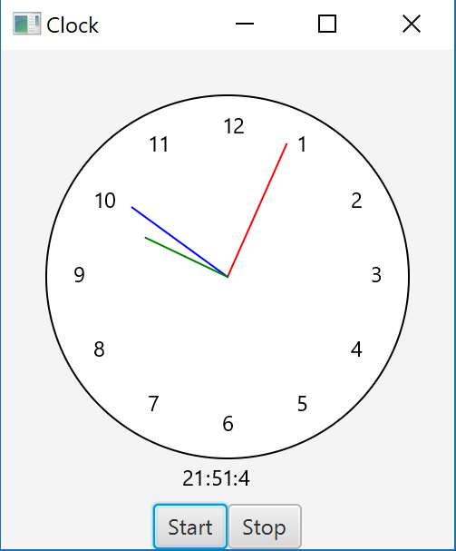

# 15.32 ClockControl

Edit Exixting Code to Animate the Drawn Clock.

## Example Output

This image will display as your example output. Name the image README.jpg in your project folder.

## Analysis Steps

I had alot of trouble with this one. Animation is a concept that I'm struggling with. I used alot of guides and tutorials for thiis assignment as it was stumping me quite a bit. I did end up getting it to function, but with some missing functionality.

## Notes

With the time I spent trying to make the program function I did develope a deeper understanding of how Gregorian Calendar translates into the clock and thought that was interesting.

## Do not change content below this line
## Adapted from a README Built With

* [Dropwizard](http://www.dropwizard.io/1.0.2/docs/) - The web framework used
* [Maven](https://maven.apache.org/) - Dependency Management
* [ROME](https://rometools.github.io/rome/) - Used to generate RSS Feeds

## Contributing

Please read [CONTRIBUTING.md](https://gist.github.com/PurpleBooth/b24679402957c63ec426) for details on our code of conduct, and the process for submitting pull requests to us.

## Versioning

We use [SemVer](http://semver.org/) for versioning. For the versions available, see the [tags on this repository](https://github.com/your/project/tags). 

## Authors

* **Billie Thompson** - *Initial work* - [PurpleBooth](https://github.com/PurpleBooth)

See also the list of [contributors](https://github.com/your/project/contributors) who participated in this project.

## License

This project is licensed under the MIT License - see the [LICENSE.md](LICENSE.md) file for details

## Acknowledgments

* Hat tip to anyone who's code was used
* Inspiration
* etc
