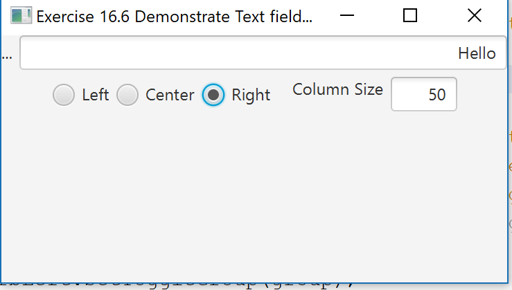

## Exercise16_6

Allows a Text Field to be resized by another Text Field and aligned by Radio Buttons.

## Example Output

This image will display as your example output. Name the image README.jpg in your project folder.

## Analysis Steps

The Asiignment was: Write a program that sets the horizontal alignment and column-size properties of a text field dynamically.
I spent a couple of hourse flipping throught previous chapter and made sure I had a grasp Listeners and Lambdas. I then watched the videos in the chapter and started to understand a bit more what the assignment was asking from me.

### Design

THe design and organization of the project closely mirrors lessons taught through the video lessons. This is because I couldn't think of an easier way to organize the code.

### Testing

I first wanted to get the toggle function in the radio buttons to work, they were a bit buggy, but It was just syntactical errors.
The second Challenge was to figure out the syntax for the parser in the setPrefColumnCount property. The rest was pretty straight forward.

End with an example of getting some data out of the system or using it for a little demo

## Notes

None Here :]

## Do not change content below this line
## Adapted from a README Built With

* [Dropwizard](http://www.dropwizard.io/1.0.2/docs/) - The web framework used
* [Maven](https://maven.apache.org/) - Dependency Management
* [ROME](https://rometools.github.io/rome/) - Used to generate RSS Feeds

## Contributing

Please read [CONTRIBUTING.md](https://gist.github.com/PurpleBooth/b24679402957c63ec426) for details on our code of conduct, and the process for submitting pull requests to us.

## Versioning

We use [SemVer](http://semver.org/) for versioning. For the versions available, see the [tags on this repository](https://github.com/your/project/tags). 

## Authors

* **Billie Thompson** - *Initial work* - [PurpleBooth](https://github.com/PurpleBooth)

See also the list of [contributors](https://github.com/your/project/contributors) who participated in this project.

## License

This project is licensed under the MIT License - see the [LICENSE.md](LICENSE.md) file for details

## Acknowledgments

* Hat tip to anyone who's code was used
* Inspiration
* etc
